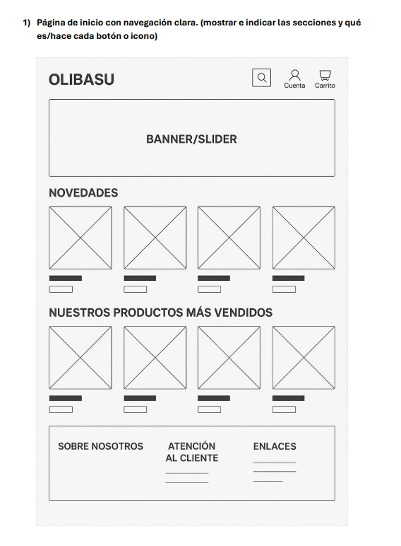
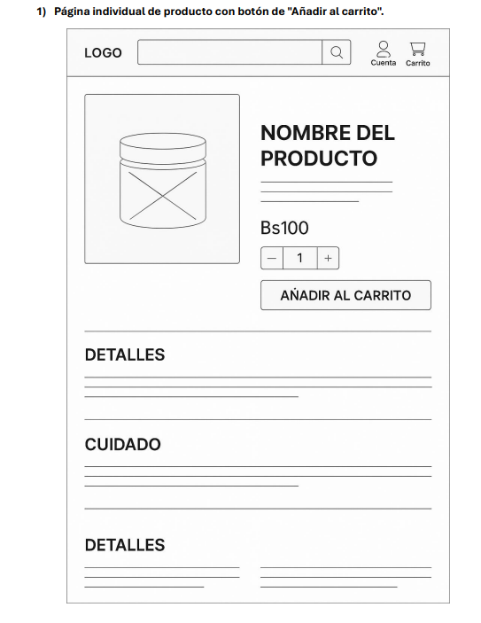
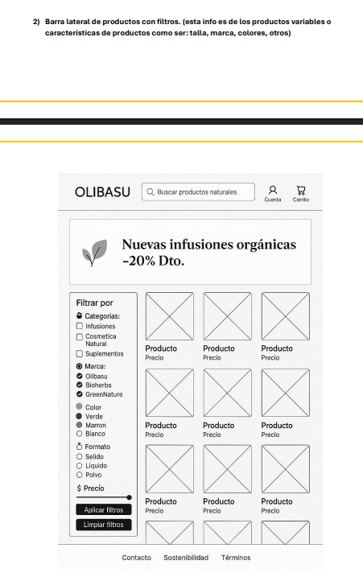
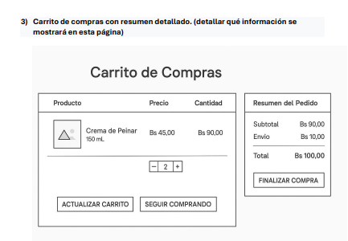
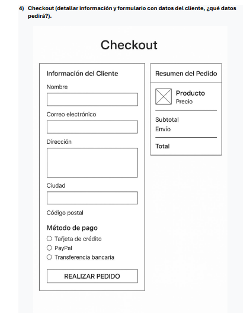
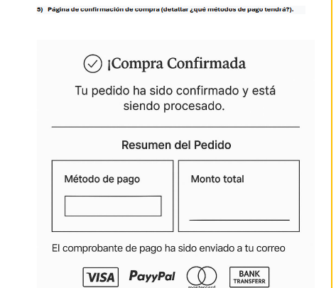

# 🧾 Cotización: Plataforma eCommerce OLIBASU

**Fecha**: Junio 2025  
**Proyecto**: Desarrollo de plataforma eCommerce para OLIBASU  
**Cliente**: Olibasu  

---

## 📌 Objetivo del Proyecto

Desarrollar una plataforma de comercio electrónico para la marca OLIBASU enfocada en productos naturales y sostenibles, brindando una experiencia de usuario moderna, fluida y adaptada a los estándares de UX/UI actuales.

---

## 📦 Alcance del Proyecto

### 1. 🏠 Página de inicio

- Header: logo, buscador, icono de cuenta y carrito
- Banner principal con CTA
- Secciones de novedades y productos más vendidos
- Footer con info legal y contacto

---

### 2. 📄 Página individual de producto

- Imagen del producto
- Nombre, precio, selector de cantidad
- Botón "Añadir al carrito"
- Sección de detalles y cuidados

---

### 3. 🧰 Catálogo con filtros laterales

- Filtros por categoría, marca, color, formato y precio
- Grilla de productos
- Botones para aplicar o limpiar filtros

---

### 4. 🛒 Carrito de compras

- Lista con productos añadidos: nombre, cantidad, subtotal
- Botones para modificar y continuar compra
- Resumen del pedido con total

---

### 5. ✅ Checkout

- Formulario: nombre, email, dirección, ciudad, código postal
- Métodos de pago: tarjeta, PayPal, transferencia
- Resumen del pedido y botón "Realizar pedido"

---

### 6. 📬 Confirmación de compra

- Mensaje de éxito con resumen de pago
- Visualización de método y monto
- Confirmación por correo electrónico
- Métodos de pago disponibles

---

## 💻 Tecnología Propuesta

- **Frontend**: ReactJS + TailwindCSS
- **Backend**: Node.js + Express (sugerido)
- **Base de Datos**: MongoDB / Firebase
- **UX/UI**: Wireframes diseñados para experiencia de usuario
- **Responsive**: Sí

---

## ⏱ Cronograma Estimado

| Fase                         | Duración Estimada |
|------------------------------|-------------------|
| Prototipado y planificación  | 1 semana          |
| Desarrollo de frontend       | 2 semanas         |
| Integración de lógica interna| 1 semana          |
| Pruebas y validación UX      | 1 semana          |
| Documentación final          | 2 días            |

---

## 💰 Estimación de Costos

| Concepto                              | Costo Estimado (Bs) |
|---------------------------------------|----------------------|
| Prototipado y diseño UI               | 2000                 |
| Desarrollo de frontend completo       | 12000                |
| Módulo de carrito y checkout          | 5000                 |
| Documentación y pruebas finales       | 2000                 |
| **Total**                             | **Bs 21000**         |

